# Open Cascade Lessons ([Quaoar's Workshop](https://www.youtube.com/c/QuaoarsWorkshop)) on Windows 10
* Several factors have impelled me to go through this series of lessons and **complete them using Visual Studio on Windows**
	* I have dabbled with pythonOCC for years, shying away from OpenCascade using C++
	* I have recently spun up on learning C++
	* Historically, I have found precious few code examples of OpenCascade or Python OCC
		* These lessons have just recently become available (about a year ago)
	* I have been stuck trying to figure out how to implement OCAF / XCAF in Kodacad
	* The author of this series, Sergey Slyadnev, is the nearest thing to a subject matter expert as I have ever found
		* So if I hope to learn from him, I need to put in the time to compete all his lessons (on Windows)
			* Many of the lessons will **only** run on Windows.
			* All these tutorials are done using Visual Studio on Windows
		* The author is also associated with [Analysis Situs](http://www.analysissitus.org/) which has a [forum](http://analysissitus.org/forum/index.php) where members can get answers to OpenCascade (C++) related questions. 
		* I definitely have questions:
			* Using Undo / Redo
			* Using app.SaveAs / app.Load()
			* How to load step files into an existing TDocStd document
			* How to manipulate the hierarcdhical assembly structure
		* So I need to be able to ask questions in their language (C++ on Windows):
			1. Take a stab at how to do whatever (in C++ on Windows)
			2. I then need to be able to implement their suggestions (in C++ on Windows)
		* Only then will it make sense to translate the solution into Python syntax.
			* I have already seen that there is no patience for broadening the scope of interest to include PythonOCC.
			* I posted a comment on Lesson 15 with a link to my pythonOCC equivalent code to the C++ code and it was quietly and quickly removed.

```
Important!
As I went through the Quaor's Workshop OpenCascade tutorials, I learned that (with the exception of Lesson 2) they all use AIS Viewer to display solid shapes. The C++ code for using the AIS Viewer is written to ONLY compile on Windows.
```

## Lesson 2: OpenCascade & VTK
* I had previously tried using some pre-compiled binaries for OpenCascade on Windows, not following the instructions explicitly, but this led to disappointing results, so this time through, I am following the instructions in careful detail.
* In preparation for going through this tutorial, I removed the build directory and the install directory.
* I uninstalled and re-installed Visual Studio (because I thought it had gotten into a non-default configuration)
* I also uninstalled and re-installed cmake, because the cmake-gui wasn't letting me enter an include dir path.
* [Lesson 1: Configure Visual Studio for OpenCascade](https://www.youtube.com/watch?v=i5zCHArA06E&t=471s) is a very helpful introduction to using Visual Studio.
* The video [Build OpenCascade on Windows (Russian)](https://www.youtube.com/watch?v=sSGATBmrgQ0&t=242s) is helpful because it walks through the preliminary steps of getting the neccesary 3rd Party s/w in place in a `products` folder.
* But don't go past (2:50/7:10) in the video. We need to go to the Lesson 2 video to load VTK.
* When I got to the step where I was using cmake-gui to configure opencascade, I ended up using the settings shown below:
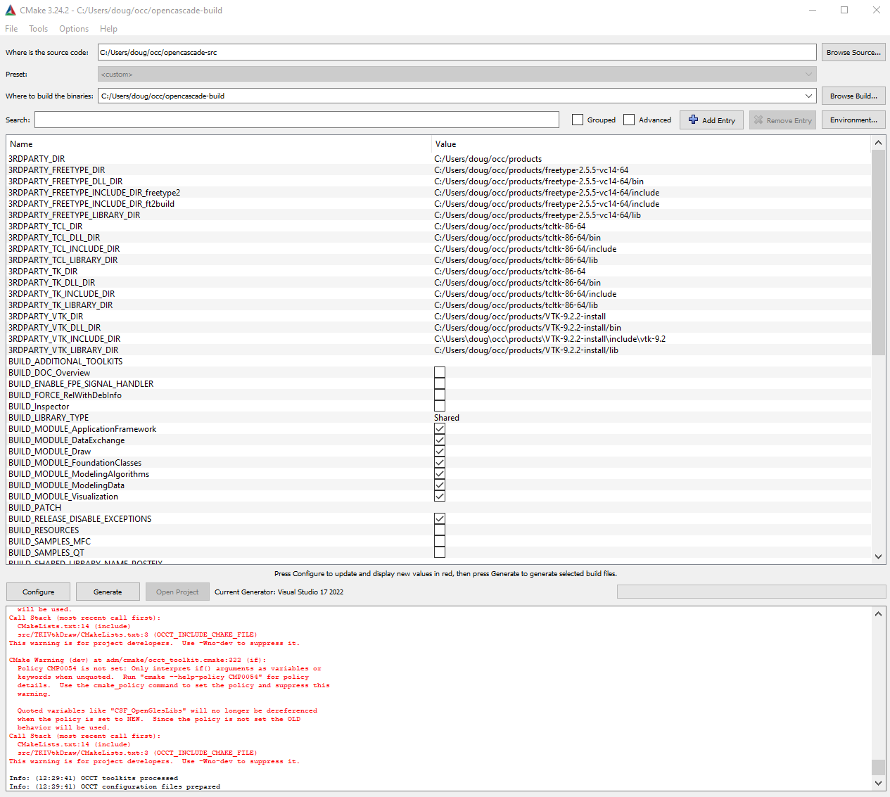
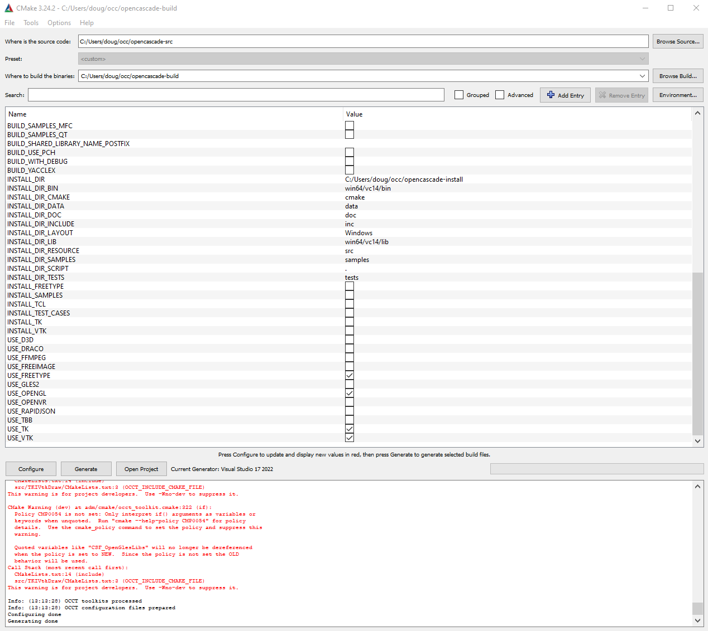
* Further into the video, `Draw.exe` was launched and I used it to display a simple box.
* 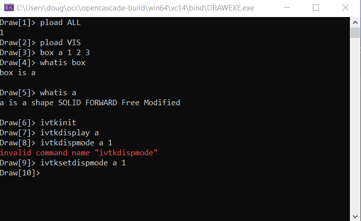
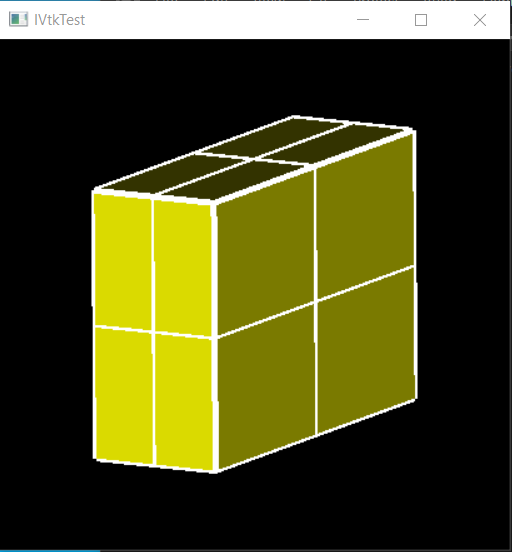
* 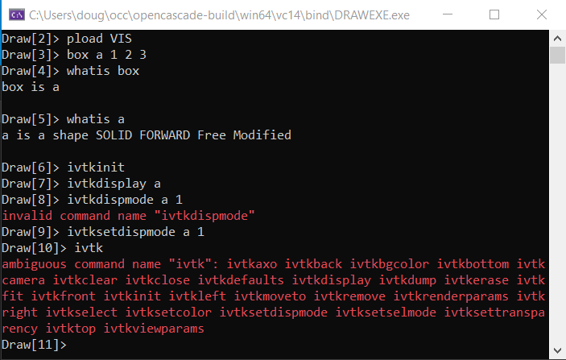
* A bit later, I got everything to compile, but got a runtime error.
* 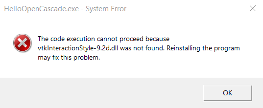
	* I eventually figured out that when I configure the environment (under debugger)
		* I can't have a 'space' like `PATH =c:\...`
		* It must be `PATH=c\...`

## Lesson 4: Visualization in OpenCascade
* Whereas in Lesson 2, VTK was used for display (OpenCascade was installed in a way that allowed it to have a "bridged" connection to VTK), in this lesson, we are using AIS for display.
* Going through this now in Windows 10 using Visual Studio, this tutorial teaches the details of configuring using the Visual Studio properties interface.

```
Configuration for Lesson4
(lines are joined into one line using semicolon ';' separators)

C/C++
	General
		Addditional Include directories:

C:\Users\doug\occ\opencascade-install\inc
%(AdditionalIncludeDirectories)


Linker
	General
		Additional Library Directories:

C:\Users\doug\occ\opencascade-install\win64\vc14\libd
%(AdditionalLibraryDirectories)


Linker
	Input
		Additional Dependencies:

TKernel.lib
TKMath.lib
TKTopAlgo.lib
TKBRep.lib
TKPrim.lib
TKOpenGL.lib
TKV3d.lib
TKService.lib
kernel32.lib
user32.lib
gdi32.lib
winspool.lib
%(AdditionalDependencies)


Debugging
	environment:

PATH=C:\Users\doug\occ\opencascade-install\win64\vc14\bind
C:\Users\doug\occ\products\freetype-2.5.5-vc14-64\bin
%PATH%$(LocalDebuggerEnvironment)
```

## Lesson 5: Configuring with CMake
* Lesson 5 teaches a new way of configuring the previous project, using a CMakeLists.txt file to accomplish the configuration details previously done in Visual Studio properties window.
* This is very helpful, teaching a configuration approach with several advantages:
    * This makes the project more **portable** by using what look like "CMAKE_ENVIRONMENT_VARIABLES" to configure the locations of directories for includes, libraries, dlls/shared libraries etc.
        * For example, I placed the project folder on the Windows Desktop, rather than in the`C:\Users\doug\source\repos` folder with all the other Visual Studio projects.
    * Replaces the tedious task of having to discover all the needed include files and listing them with using a `foreach` loop to load them all.
    * By weaning away from using the Visual Studio properties window, it opens the door to using other IDE's on other platforms.
* The first step in the new process is to open cmake-gui and configure it like so:

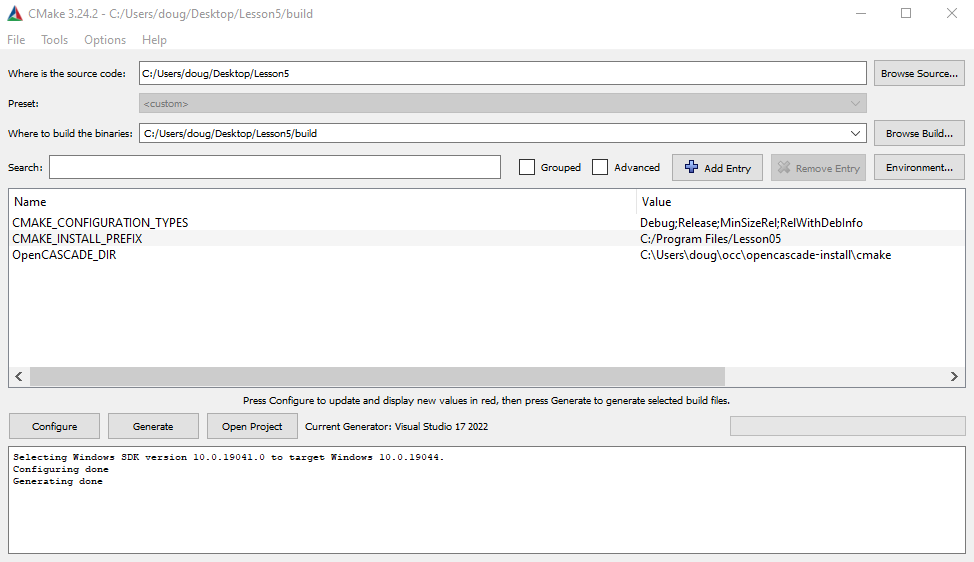

* Click sequentially on **Configure** then **Generate** then **Open Project**
* Then close Visual Studio after each time through this cycle.
* On the "final cycle", right click on the project in Visual Studio and click "Set as Startup Project". Then hit F5 key to run executable. This almost worked, producing the following error.

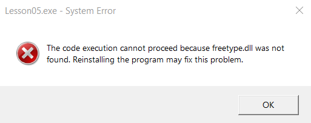

* I know what to do for this. I stumbled on this earlier in Lesson 4. I have to add the path to `freetype.dll` to the runtime environment. Currently it is not there, as can be seen in this screenshot of the Visual Studio property page.

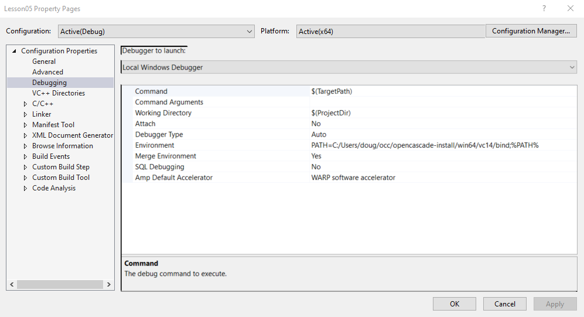

* I tried adding it in CMakeLists.txt but that resulted in a configuration error. So I went ahead and added it by editing the environment PATH in the property page. This allowed the executable to work.
* Interestingly, when I used CMakeLists.txt to build Lesson_04 on Ubuntu, I didn't face this same problem. I believe the reason is that when I installed OpenCascade in Ubuntu, I installed freetype **prior** to installing OpenCascade, so its shared library is in a standard location, requiring no tinkering with **PATH**.
* Another thing I did on Ubuntu was to set Open_CASCADE_DIR in the CMakeLists.txt file. (In Windows it was done using VisualStudio property pages.)
* Below is `CMakeLists.txt` used on Ubuntu. Using this as a template, perhaps it will now be possible to build any of Quaoar's Workshop OpenCascade Lessons on Ububntu (as long as they don't contain **Windows only** code).

```
cmake_minimum_required (VERSION 3.0.0 FATAL_ERROR)

SET(CMAKE_INSTALL_PREFIX "/home/doug/OCC/opencascade-install")

SET(OpenCASCADE_DIR "/home/doug/OCC/opencascade-install/lib/cmake/opencascade")

project(Lesson_04 CXX)

find_package(OpenCASCADE)

# Configure C++ compiler's includes dir
include_directories(SYSTEM ${OpenCASCADE_INCLUDE_DIR})

add_executable(Lesson_04
  main.cpp
  Viewer.cpp
  ViewerInteractor.cpp
  Viewer.h
  ViewerInteractor.h
)

message(STATUS "OpenCASCADE_LIBRARY_DIR= ${OpenCASCADE_LIBRARY_DIR}")

# Add linker options
foreach(LIB ${OpenCASCADE_LIBRARIES})
  target_link_libraries(Lesson_04 debug ${OpenCASCADE_LIBRARY_DIR}/lib${LIB}.so)
  message(STATUS "LIB=${LIB}")
endforeach()
```

## Lesson 10: OCAF Part 1: First Steps

#### CMake config:
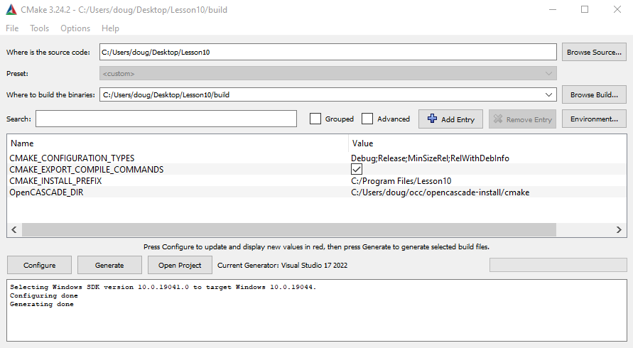
#### CMakeLists.txt:
```
cmake_minimum_required (VERSION 3.0.0 FATAL_ERROR)

project(Lesson10 CXX)

find_package(OpenCASCADE)

include_directories(SYSTEM ${OpenCASCADE_INCLUDE_DIR})

add_executable(Lesson10
    main.cpp
)

target_link_libraries(Lesson10 debug C:/Users/doug/occ/products/freetype-2.5.5-vc14-64/lib/freetype.lib)
foreach(LIB ${OpenCASCADE_LIBRARIES})
    target_link_libraries(Lesson10 debug ${OpenCASCADE_LIBRARY_DIR}d/${LIB}.lib)
endforeach()

set_property(TARGET Lesson10 PROPERTY VS_DEBUGGER_ENVIRONMENT "PATH=$<$<CONFIG:DEBUG>:${OpenCASCADE_BINARY_DIR}d>$<$<NOT:$<CONFIG:DEBUG>>:${OpenCASCADE_BINARY_DIR}>;%PATH%")
```
#### main.cpp:
```
// OpenCascade includes
#include <TDocStd_Application.hxx>
#include <TDataStd_Integer.hxx>
#include <BinDrivers.hxx>

int main()
{
	Handle(TDocStd_Application)
		app = new TDocStd_Application;
	//
	BinDrivers::DefineFormat(app);

	Handle(TDocStd_Document) doc;
	app->NewDocument("BinOcaf", doc);
	//
	if (doc.IsNull())
	{
		std::cout << "Error: connot create an OCAF document." << std::endl;
		return 1;
	}

	/* 0
	   |
	   o-> 1 [0:1] // main label
	*/ 

	TDF_Label mainLab = doc->Main();

	TDataStd_Integer::Set(mainLab, 199);

	PCDM_StoreStatus sstatus = app->SaveAs(doc, "C:/Users/doug/Desktop/test");
	//
	if (sstatus != PCDM_SS_OK)
	{
		app->Close(doc);

		std::cout << "Cannot write OCAF document." << std::endl;
		return 1;
	}

	app->Close(doc);
	return 0;
}
```
* This was a **really simple** exercise in which we:
    * Created an app
    * Created a document
    * Created a 'main' label in the doc
    * Attached an integer attribute (value=199) to the label
    * Saved the document as `test.cbf`
* Finally, we used DRAW to open a DFBrowser to examine the document.

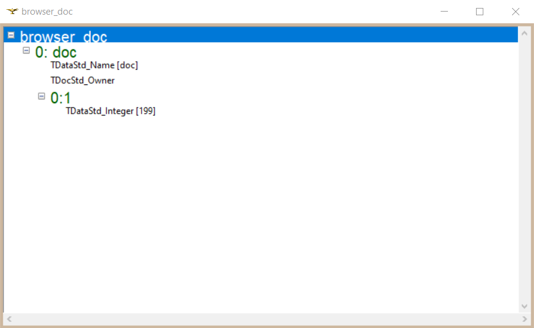

* Getting DRAW and DFBrowser to work proved to be kind of tricky.
    * I couldn't launch DRAW in Windows, because DRAW only launches in the Release version, not Debug version.
    * So I decided to try it in Ubuntu
        * I was able to launch DRAW OK, and start DFBrowser, but the label hierarchy didn't show up.
    * Finally, I downloaded opencascade for windows (installed under c: root)
        * Now DRAW works and DFBrowser displays the doc structure.

#### DRAW commands to open DFBrowser:
```
pload ALL
Open c:/Users/doug/test.cbf doc
DFBrowse doc
```

## Lesson 11: OCAF Part 2: Deep Dive

* This was a more detailed exercise (albeit contrived) in creating an OCAF document:
    * Classes were developed making it easy to create labels for holding various specialized attributes
        * Parts (preumably TopoDS_Shapes)
        * Features
        * Meshes 
* Saved the document as `test.cbf`
* Used DRAW to open a DFBrowser to examine the document.
    * Parts are represented by labels under [0:1]
        * (Only part2 actually had a TopoDS_Shape)
        * Despite not actually having a shape, part3 got features
    * Features are children of associated part label
    * Meshes are represented by labels under [0:2]
        * One mesh was created (shown referring to part 2)

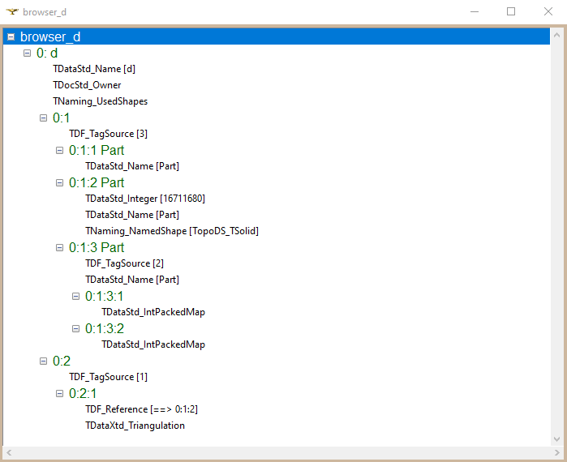

#### CMake config:  (Only **deliberate** change is to replace occurences of '10' with '11')
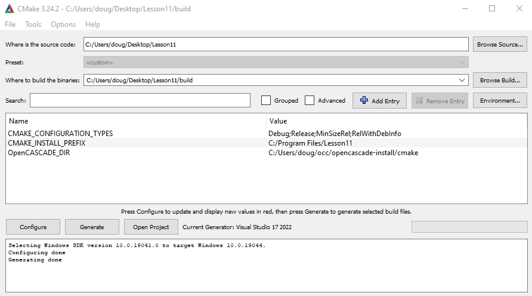
#### CMakeLists.txt:  (Only change is to replace occurences of '10' with '11')
```
cmake_minimum_required (VERSION 3.0.0 FATAL_ERROR)

project(Lesson11 CXX)

find_package(OpenCASCADE)

include_directories(SYSTEM ${OpenCASCADE_INCLUDE_DIR})

add_executable(Lesson11
    main.cpp
)

target_link_libraries(Lesson11 debug C:/Users/doug/occ/products/freetype-2.5.5-vc14-64/lib/freetype.lib)
foreach(LIB ${OpenCASCADE_LIBRARIES})
    target_link_libraries(Lesson11 debug ${OpenCASCADE_LIBRARY_DIR}d/${LIB}.lib)
endforeach()

set_property(TARGET Lesson11 PROPERTY VS_DEBUGGER_ENVIRONMENT "PATH=$<$<CONFIG:DEBUG>:${OpenCASCADE_BINARY_DIR}d>$<$<NOT:$<CONFIG:DEBUG>>:${OpenCASCADE_BINARY_DIR}>;%PATH%")
```

#### main.cpp:
```
// OpenCascade includes
#include <TDocStd_Application.hxx>
#include <TDataStd_Integer.hxx>
#include <BinDrivers.hxx>

#include <TDataStd_Name.hxx>
#include <TNaming_Builder.hxx>
#include <TNaming_NamedShape.hxx>
#include <TopoDS_Shape.hxx>
#include <BRepPrimAPI_MakeBox.hxx>
#include <TDataStd_IntPackedMap.hxx>
#include <TDF_ChildIterator.hxx>
#include <TopExp_Explorer.hxx>
#include <TopoDS.hxx>
#include <TDataXtd_Triangulation.hxx>
#include <TDF_Reference.hxx>
#include <BRepMesh_IncrementalMesh.hxx>

#include <vector>

class IFeature
{
public:

	IFeature(const TDF_Label& label) : m_root(label)
	{}

public:

	void SetFaces(const TColStd_PackedMapOfInteger& fids)
	{
		Handle(TDataStd_IntPackedMap) attr = TDataStd_IntPackedMap::Set(m_root);
		attr->ChangeMap(fids);
	}

private:

	TDF_Label m_root;

};

class IPart
{
public:

	IPart(const TDF_Label& label) : m_root(label)
	{
		TDataStd_Name::Set(label, "Part");
    }

public:

	const TDF_Label& GetLabel() const
	{
		return m_root;
	}

	IFeature CreateFeature(const TColStd_PackedMapOfInteger& fids)
	{
		TDF_Label featureRootLab = TDF_TagSource::NewChild(m_root);
		IFeature feature(featureRootLab);
		feature.SetFaces(fids);
		return feature;
	}

	void GetFeatures(std::vector<IFeature>& features)
	{
		for (TDF_ChildIterator cit(m_root); cit.More(); cit.Next())
		{
			features.push_back( IFeature( cit.Value() ) );
		}
	}

	void SetShape(const TopoDS_Shape& shape)
	{
		TNaming_Builder builder(m_root);
		builder.Generated(shape);

		BRepMesh_IncrementalMesh meshGen(shape, 1.0);
	}

	TopoDS_Shape GetShape() const
	{
		Handle(TNaming_NamedShape) attr;
		if ( !m_root.FindAttribute(TNaming_NamedShape::GetID(), attr) )
			return TopoDS_Shape();
		
		return attr->Get();
	}

	void SetColor(const unsigned r, const unsigned b, const unsigned g)
	{
		int icolor = (r << 16) | (b << 8) << g;

		TDataStd_Integer::Set(m_root, icolor);
	}

	bool GetColor(unsigned& r, unsigned& g, unsigned& b)
	{
		Handle(TDataStd_Integer) attr;
		if ( !m_root.FindAttribute(TDataStd_Integer::GetID(), attr) )
			return false;

		const int icolor = attr->Get();

		r = ( icolor >> 16 ) & 0xFF;
		g = ( icolor >>  8 ) & 0xFF;
		b =   icolor         & 0xFF;

		return true;
	}

private:

	TDF_Label m_root;

};

class IMesh
{
public:

	IMesh(const TDF_Label& label) : m_root(label)
	{
			}

public:

	void Create(const IPart& part)
	{
		TopoDS_Shape partShape = part.GetShape();

		Handle(Poly_Triangulation) mesh;

		for ( TopExp_Explorer exp(partShape, TopAbs_FACE); exp.More(); exp.Next() )
		{
			const TopoDS_Face& face = TopoDS::Face( exp.Current() );

			TopLoc_Location loc;
			mesh = BRep_Tool::Triangulation(face, loc);
			break;
		}

		if (mesh.IsNull())
			return;

		TDataXtd_Triangulation::Set(m_root, mesh);

		TDF_Reference::Set( m_root, part.GetLabel() );
	}

private:

	TDF_Label m_root;

};

int main()
{
	Handle(TDocStd_Application)
		app = new TDocStd_Application;
	//
	BinDrivers::DefineFormat(app);

	Handle(TDocStd_Document) doc;
	app->NewDocument("BinOcaf", doc);
	//
	if (doc.IsNull())
	{
		std::cout << "Error: connot create an OCAF document." << std::endl;
		return 1;
	}

	TDF_Label partsLab  = doc->Main();
	TDF_Label meshesLab = partsLab.Father().FindChild(2);

	// Create some parts
	IPart part1( TDF_TagSource::NewChild(partsLab) );
	IPart part2( TDF_TagSource::NewChild(partsLab) );
	IPart part3( TDF_TagSource::NewChild(partsLab) );
	//
	part2.SetShape( BRepPrimAPI_MakeBox(10, 10, 10) );
	part2.SetColor(255, 0, 0);

	TColStd_PackedMapOfInteger fids1, fids2;
	fids1.Add(1);
	fids1.Add(2);
	fids1.Add(3);
	fids2.Add(3);
	fids2.Add(4);
	fids2.Add(5);

	part3.CreateFeature(fids1);
	part3.CreateFeature(fids2);

	std::vector<IFeature> part3Features;
	part3.GetFeatures(part3Features);

	// Create some meshes
	IMesh mesh( TDF_TagSource::NewChild(meshesLab) );
	//
	mesh.Create(part2);

	PCDM_StoreStatus sstatus = app->SaveAs(doc, "C:/Users/doug/Desktop/test.cbf");
	//
	if (sstatus != PCDM_SS_OK)
	{
		app->Close(doc);

		std::cout << "Cannot write OCAF document." << std::endl;
		return 1;
	}

	app->Close(doc);
	return 0;
}
```

