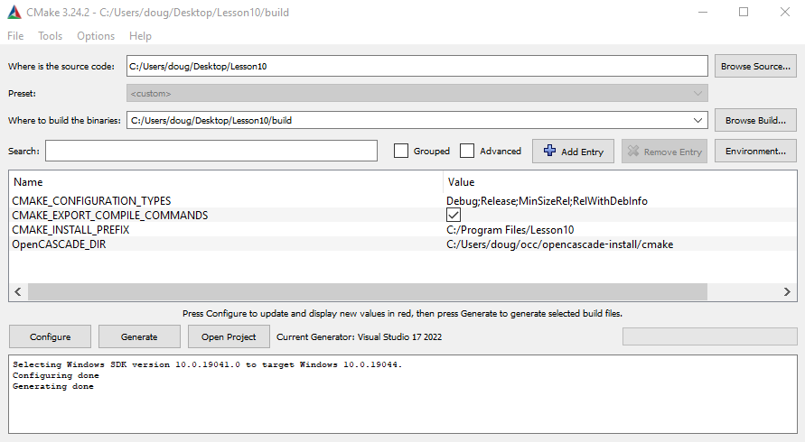
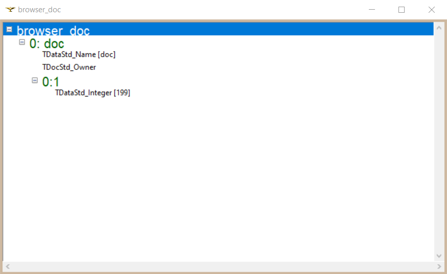

## Lesson 10: OCAF Part 1: First Steps

#### CMake config:

#### CMakeLists.txt:
```
cmake_minimum_required (VERSION 3.0.0 FATAL_ERROR)

project(Lesson10 CXX)

find_package(OpenCASCADE)

include_directories(SYSTEM ${OpenCASCADE_INCLUDE_DIR})

add_executable(Lesson10
    main.cpp
)

target_link_libraries(Lesson10 debug C:/Users/doug/occ/products/freetype-2.5.5-vc14-64/lib/freetype.lib)
foreach(LIB ${OpenCASCADE_LIBRARIES})
    target_link_libraries(Lesson10 debug ${OpenCASCADE_LIBRARY_DIR}d/${LIB}.lib)
endforeach()

set_property(TARGET Lesson10 PROPERTY VS_DEBUGGER_ENVIRONMENT "PATH=$<$<CONFIG:DEBUG>:${OpenCASCADE_BINARY_DIR}d>$<$<NOT:$<CONFIG:DEBUG>>:${OpenCASCADE_BINARY_DIR}>;%PATH%")
```
#### main.cpp:
```
// OpenCascade includes
#include <TDocStd_Application.hxx>
#include <TDataStd_Integer.hxx>
#include <BinDrivers.hxx>

int main()
{
	Handle(TDocStd_Application)
		app = new TDocStd_Application;
	//
	BinDrivers::DefineFormat(app);

	Handle(TDocStd_Document) doc;
	app->NewDocument("BinOcaf", doc);
	//
	if (doc.IsNull())
	{
		std::cout << "Error: connot create an OCAF document." << std::endl;
		return 1;
	}

	/* 0
	   |
	   o-> 1 [0:1] // main label
	*/ 

	TDF_Label mainLab = doc->Main();

	TDataStd_Integer::Set(mainLab, 199);

	PCDM_StoreStatus sstatus = app->SaveAs(doc, "C:/Users/doug/Desktop/test");
	//
	if (sstatus != PCDM_SS_OK)
	{
		app->Close(doc);

		std::cout << "Cannot write OCAF document." << std::endl;
		return 1;
	}

	app->Close(doc);
	return 0;
}
```
* This was a **really simple** exercise in which we:
    * Created an app
    * Created a document
    * Created a 'main' label in the doc
    * Attached an integer attribute (value=199) to the label
    * Saved the document as `test.cbf`
* Finally, we used DRAW to open a DFBrowser to examine the document.



* Getting DRAW and DFBrowser to work proved to be kind of tricky.
    * I couldn't launch DRAW in Windows, because DRAW only launches in the Release version, not Debug version.
    * So I decided to try it in Ubuntu
        * I was able to launch DRAW OK, and start DFBrowser, but the label hierarchy didn't show up.
    * Finally, I downloaded opencascade for windows (installed under c: root)
        * Now DRAW works and DFBrowser displays the doc structure.

#### DRAW commands to open DFBrowser:
```
pload ALL
Open c:/Users/doug/test.cbf doc
DFBrowse doc
```


