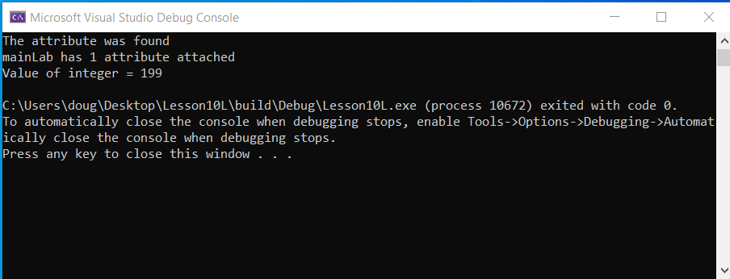

## Lesson 10L: Loading the saved file `test.cbf` saved in OCAF Part 1: First Steps


#### CMakeLists.txt:
* Same as Lesson 10 except changed occurences of `Lesson10` to `Lesson10L`
* [Ugo Capeto's blog](http://myopencascade.blogspot.com/2010/03/shape-attributes-with-ocaf.html) was helpful

#### main.cpp:
``` C++
// OpenCascade includes
#include <TDocStd_Application.hxx>
#include <TDataStd_Integer.hxx>
#include <BinDrivers.hxx>

int main()
{
	Handle(TDocStd_Application)
		app = new TDocStd_Application;
	//
	BinDrivers::DefineFormat(app);

	Handle(TDocStd_Document) doc;
	app->Open("C:/Users/doug/Desktop/test.cbf", doc);
	//
	if (doc.IsNull())
	{
		std::cout << "Error: cannot create an OCAF document." << std::endl;
		return 1;
	}

	/* 0
	   |
	   o-> 1 [0:1] // main label
	*/ 

	TDF_Label mainLab = doc->Main();

	Handle(TDataStd_Integer) INT;
	if (mainLab.FindAttribute(TDataStd_Integer::GetID(), INT))
	{
		// the attribute is found 
		std::cout << "The attribute was found" << std::endl;
	}
	else
	{
		// the attribute is not found 
		std::cout << "The attribute was not found" << std::endl;
	}

	if (mainLab.HasAttribute()) {
		// the label has at least one attribute attached 
		Standard_Integer nbatt = mainLab.NbAttributes();
		// the label has nbatt attributes attached 
		std::cout << "mainLab has " << nbatt << " attribute attached" << std::endl;
	}

	int aValue = INT->Get();

	std::cout << "Value of integer = " << aValue << std::endl;

	app->Close(doc);
	return 0;
}
```


