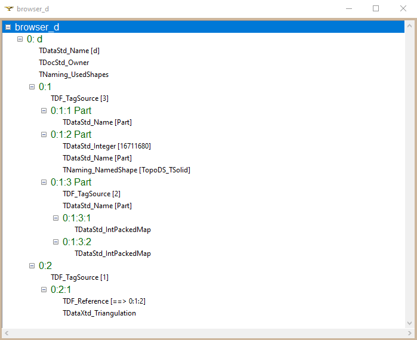
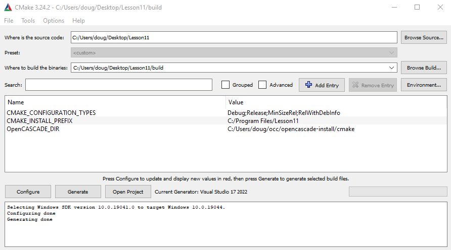

## Lesson 11: OCAF Part 2: Deep Dive

* This was a more detailed exercise (albeit contrived) in creating an OCAF document:
    * Classes were developed making it easy to create labels for holding various specialized attributes
        * Parts (presumably TopoDS_Shapes)
        * Features
        * Meshes 
* Saved the document as `test.cbf`
* Used DRAW to open a DFBrowser to examine the document.
    * Parts are represented by labels under [0:1]
        * (Only part2 actually had a TopoDS_Shape)
        * Despite not actually having a shape, part3 got features
    * Features are children of associated part label
    * Meshes are represented by labels under [0:2]
        * One mesh was created (shown referring to part 2)



#### CMake config:  (Only **deliberate** change is to replace occurences of '10' with '11')

#### CMakeLists.txt:  (Only change is to replace occurences of '10' with '11')
```
cmake_minimum_required (VERSION 3.0.0 FATAL_ERROR)

project(Lesson11 CXX)

find_package(OpenCASCADE)

include_directories(SYSTEM ${OpenCASCADE_INCLUDE_DIR})

add_executable(Lesson11
    main.cpp
)

target_link_libraries(Lesson11 debug C:/Users/doug/occ/products/freetype-2.5.5-vc14-64/lib/freetype.lib)
foreach(LIB ${OpenCASCADE_LIBRARIES})
    target_link_libraries(Lesson11 debug ${OpenCASCADE_LIBRARY_DIR}d/${LIB}.lib)
endforeach()

set_property(TARGET Lesson11 PROPERTY VS_DEBUGGER_ENVIRONMENT "PATH=$<$<CONFIG:DEBUG>:${OpenCASCADE_BINARY_DIR}d>$<$<NOT:$<CONFIG:DEBUG>>:${OpenCASCADE_BINARY_DIR}>;%PATH%")
```

#### main.cpp:
```
// OpenCascade includes
#include <TDocStd_Application.hxx>
#include <TDataStd_Integer.hxx>
#include <BinDrivers.hxx>

#include <TDataStd_Name.hxx>
#include <TNaming_Builder.hxx>
#include <TNaming_NamedShape.hxx>
#include <TopoDS_Shape.hxx>
#include <BRepPrimAPI_MakeBox.hxx>
#include <TDataStd_IntPackedMap.hxx>
#include <TDF_ChildIterator.hxx>
#include <TopExp_Explorer.hxx>
#include <TopoDS.hxx>
#include <TDataXtd_Triangulation.hxx>
#include <TDF_Reference.hxx>
#include <BRepMesh_IncrementalMesh.hxx>

#include <vector>

class IFeature
{
public:

	IFeature(const TDF_Label& label) : m_root(label)
	{}

public:

	void SetFaces(const TColStd_PackedMapOfInteger& fids)
	{
		Handle(TDataStd_IntPackedMap) attr = TDataStd_IntPackedMap::Set(m_root);
		attr->ChangeMap(fids);
	}

private:

	TDF_Label m_root;

};

class IPart
{
public:

	IPart(const TDF_Label& label) : m_root(label)
	{
		TDataStd_Name::Set(label, "Part");
    }

public:

	const TDF_Label& GetLabel() const
	{
		return m_root;
	}

	IFeature CreateFeature(const TColStd_PackedMapOfInteger& fids)
	{
		TDF_Label featureRootLab = TDF_TagSource::NewChild(m_root);
		IFeature feature(featureRootLab);
		feature.SetFaces(fids);
		return feature;
	}

	void GetFeatures(std::vector<IFeature>& features)
	{
		for (TDF_ChildIterator cit(m_root); cit.More(); cit.Next())
		{
			features.push_back( IFeature( cit.Value() ) );
		}
	}

	void SetShape(const TopoDS_Shape& shape)
	{
		TNaming_Builder builder(m_root);
		builder.Generated(shape);

		BRepMesh_IncrementalMesh meshGen(shape, 1.0);
	}

	TopoDS_Shape GetShape() const
	{
		Handle(TNaming_NamedShape) attr;
		if ( !m_root.FindAttribute(TNaming_NamedShape::GetID(), attr) )
			return TopoDS_Shape();
		
		return attr->Get();
	}

	void SetColor(const unsigned r, const unsigned b, const unsigned g)
	{
		int icolor = (r << 16) | (b << 8) << g;

		TDataStd_Integer::Set(m_root, icolor);
	}

	bool GetColor(unsigned& r, unsigned& g, unsigned& b)
	{
		Handle(TDataStd_Integer) attr;
		if ( !m_root.FindAttribute(TDataStd_Integer::GetID(), attr) )
			return false;

		const int icolor = attr->Get();

		r = ( icolor >> 16 ) & 0xFF;
		g = ( icolor >>  8 ) & 0xFF;
		b =   icolor         & 0xFF;

		return true;
	}

private:

	TDF_Label m_root;

};

class IMesh
{
public:

	IMesh(const TDF_Label& label) : m_root(label)
	{
			}

public:

	void Create(const IPart& part)
	{
		TopoDS_Shape partShape = part.GetShape();

		Handle(Poly_Triangulation) mesh;

		for ( TopExp_Explorer exp(partShape, TopAbs_FACE); exp.More(); exp.Next() )
		{
			const TopoDS_Face& face = TopoDS::Face( exp.Current() );

			TopLoc_Location loc;
			mesh = BRep_Tool::Triangulation(face, loc);
			break;
		}

		if (mesh.IsNull())
			return;

		TDataXtd_Triangulation::Set(m_root, mesh);

		TDF_Reference::Set( m_root, part.GetLabel() );
	}

private:

	TDF_Label m_root;

};

int main()
{
	Handle(TDocStd_Application)
		app = new TDocStd_Application;
	//
	BinDrivers::DefineFormat(app);

	Handle(TDocStd_Document) doc;
	app->NewDocument("BinOcaf", doc);
	//
	if (doc.IsNull())
	{
		std::cout << "Error: connot create an OCAF document." << std::endl;
		return 1;
	}

	TDF_Label partsLab  = doc->Main();
	TDF_Label meshesLab = partsLab.Father().FindChild(2);

	// Create some parts
	IPart part1( TDF_TagSource::NewChild(partsLab) );
	IPart part2( TDF_TagSource::NewChild(partsLab) );
	IPart part3( TDF_TagSource::NewChild(partsLab) );
	//
	part2.SetShape( BRepPrimAPI_MakeBox(10, 10, 10) );
	part2.SetColor(255, 0, 0);

	TColStd_PackedMapOfInteger fids1, fids2;
	fids1.Add(1);
	fids1.Add(2);
	fids1.Add(3);
	fids2.Add(3);
	fids2.Add(4);
	fids2.Add(5);

	part3.CreateFeature(fids1);
	part3.CreateFeature(fids2);

	std::vector<IFeature> part3Features;
	part3.GetFeatures(part3Features);

	// Create some meshes
	IMesh mesh( TDF_TagSource::NewChild(meshesLab) );
	//
	mesh.Create(part2);

	PCDM_StoreStatus sstatus = app->SaveAs(doc, "C:/Users/doug/Desktop/test.cbf");
	//
	if (sstatus != PCDM_SS_OK)
	{
		app->Close(doc);

		std::cout << "Cannot write OCAF document." << std::endl;
		return 1;
	}

	app->Close(doc);
	return 0;
}
```

