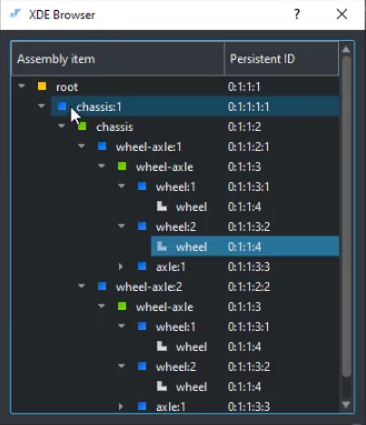
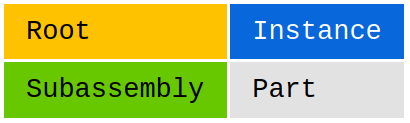

# Notes from Lesson 12: CAD Assemblies with OpenCascade

### Using Browser Tool from Analysis Situs [XDE In Nutshell](http://analysissitus.org/features/features_asm-xde-document.html) to examine chassis.stp:

* This is basically a **Scene Tree**.
* Note the **root** label entry is **0:1:1:1**
* There are four (4) occurences of wheel (label entry 0:1:1:4) each with different transformations
* The ultimate transformation of the highlighted wheel, for example, is composed of all the transformations in the chain of references (shown w/ blue icons) in the assembly hierarchy all the way to the root assembly.

* This **key** shows the colors that are used to represent various entity types:

* Note that all the Instance labels have Depth=5
* Whereas Root, Subassembly, and Part labels all have Depth=4
* An assembly never includes parts or subassemblies directly.
* The components are always nested by means of an intermediate instance object, which is a lightweight reference to a prototype with **location**.
* An Instance is a located reference to a Part or Subassembly.
    * An Instance is nested into a Subassembly, i.e., a Subassembly contains Instances as its child elements.
* The difference between the assembly instances and part instances is not captured by XDE entities.

