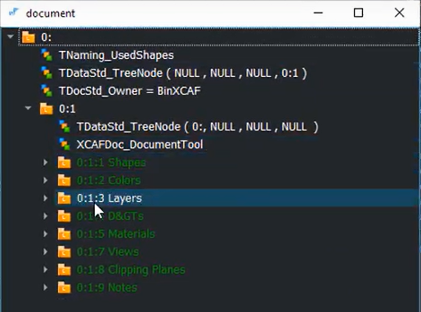

# Notes from Lesson 12: CAD Assemblies with OpenCascade

## Overview of hierarchical data structure of loaded STEP data
* OpenCascade does a nice job of loading / saving step files
    * On load, they go into an XCAF document
* Using `chassis.step` as an example

* Using Browser Tool from Analysis Situs [XDE In Nutshell](http://analysissitus.org/features/features_asm-xde-document.html) to examine

* This is basically a **Scene Tree**.
* Note the **root** label entry is **0:1:1:1**
* There are four (4) occurences of wheel (label entry 0:1:1:4) each with different transformations
* The ultimate transformation of the highlighted wheel, for example, is composed of all the transformations in the chain of references (shown w/ blue icons) in the assembly hierarchy all the way to the root assembly.

* This **key** shows the colors that are used to represent various entity types:

* Note that all the Instance labels have Depth=5
* Whereas Root, Subassembly, and Part labels all have Depth=4
* An assembly never includes parts or subassemblies directly.
* The components are always nested by means of an intermediate instance object, which is a lightweight reference to a prototype with **location**.
* An Instance is a located reference to a Part or Subassembly.
    * An Instance is nested into a Subassembly, i.e., a Subassembly contains Instances as its child elements.
* The difference between the assembly instances and part instances is not captured by XDE entities.

## The actual code was simply downloaded from [Quaoar's code website](https://gitlab.com/ssv/lessons).
* The Analysis Situs browser tool can be used to drill into the contents of the labels, starting at the top:
    * The 0:1 label holds the `Document tool`
    * It `refers to` label 0:

* 
* Shapes [0:1:1] and Colors [0:1:2] are the two categories I care about
    * the 0:1:1 label holds the `shape tool`
    * the 0:1:2 label holds the `color tool`
* 
* Shapes [0:1:1] has 5 child labels
    * root
    * chassis
    * wheel-axle
    * wheel
    * axle
* Start by drilling into the first one: `root`
* 
* `root` has but one child: 0:1:1:1:1 chassis:1
    * which refers to 0:1:1:2 chassis
    * and has an XCAFDoc_Location attribute specifying the `location' of the referred shape
* So next, we drill into 0:1:1:2 chassis
* 
* and so on ...

## Project configuration details:
* Following the instructions on the video, I set the commandline arg of
path to the step file by editing the configuration properties / Debugging
* I had the choice of configuring the project one of 2 ways:
    1. Configure within Visual Studio (as was done in Lesson2)
        * Use project properties pages to configure
    2. Run cmake-gui and use Visual Studio just to build and run (as in Lesson5)
* I chose the **educational** way: Option #1 and had a bunch of linker errors.
* To resolve the errors, I copied the complete list of linker input dependencies
from Lesson5 and pasted them into the Visual Studio project properties page for Lesson12.

