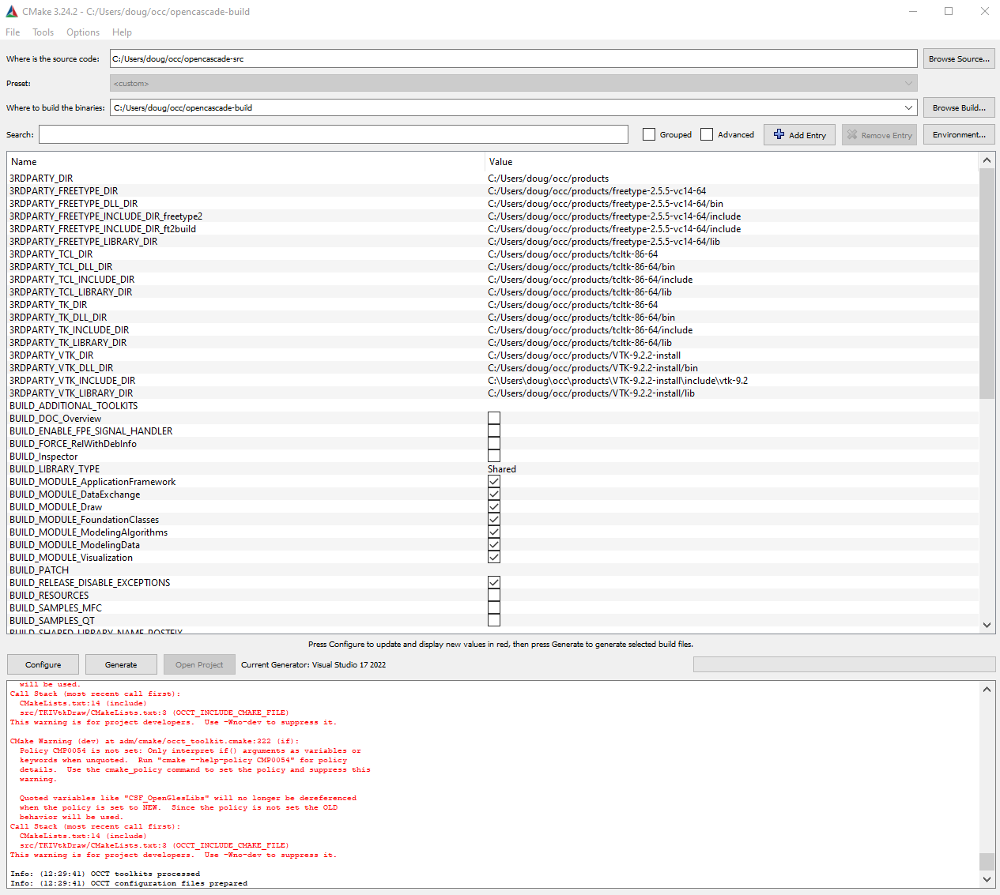
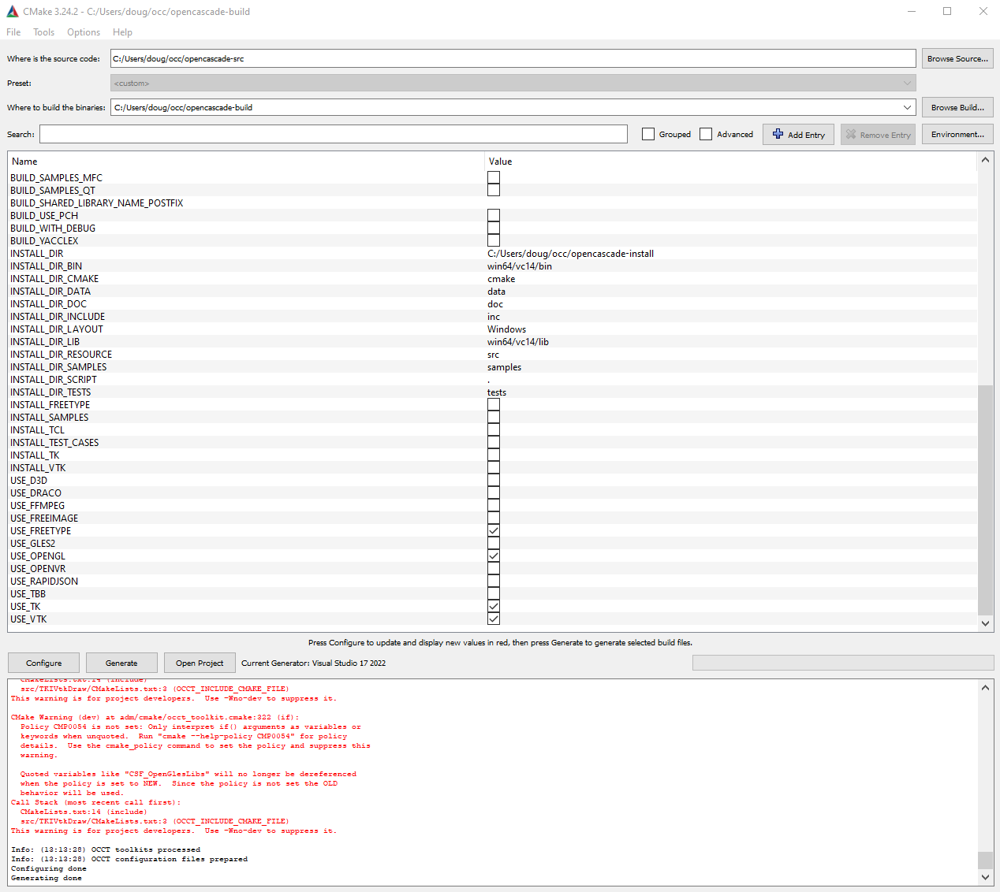
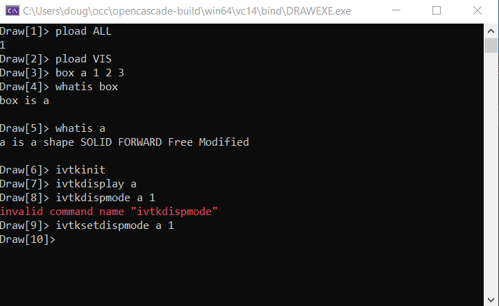
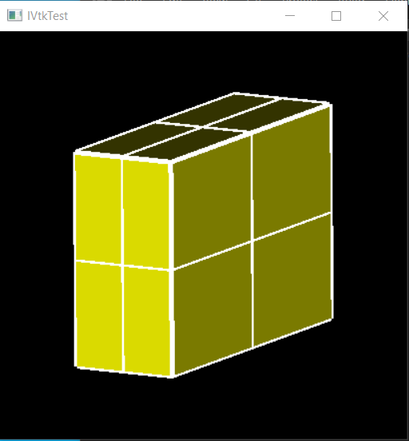
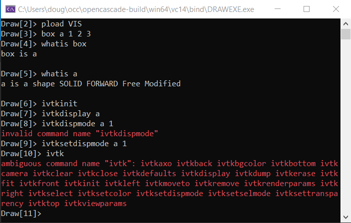
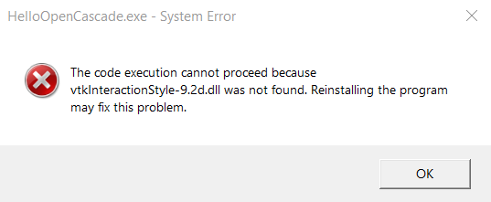

## Lesson 2: OpenCascade & VTK
* I had previously tried using some pre-compiled binaries for OpenCascade on Windows, not following the instructions explicitly, but this led to disappointing results, so this time through, I am following the instructions in careful detail.
* In preparation for going through this tutorial, I removed the build directory and the install directory.
* I uninstalled and re-installed Visual Studio (because I thought it had gotten into a non-default configuration)
* I also uninstalled and re-installed cmake, because the cmake-gui wasn't letting me enter an include dir path.
* [Lesson 1: Configure Visual Studio for OpenCascade](https://www.youtube.com/watch?v=i5zCHArA06E&t=471s) is a very helpful introduction to using Visual Studio.
* The video [Build OpenCascade on Windows (Russian)](https://www.youtube.com/watch?v=sSGATBmrgQ0&t=242s) is helpful because it walks through the preliminary steps of getting the neccesary 3rd Party s/w in place in a `products` folder.
* But don't go past (2:50/7:10) in the video. We need to go to the Lesson 2 video to load VTK.
* When I got to the step where I was using cmake-gui to configure opencascade, I ended up using the settings shown below:

* Further into the video, `Draw.exe` was launched and I used it to display a simple box.
* 

* 
* A bit later, I got everything to compile, but got a runtime error.
* 
	* I eventually figured out that when I configure the environment (under debugger)
		* I can't have a 'space' like `PATH =c:\...`
		* It must be `PATH=c\...`

