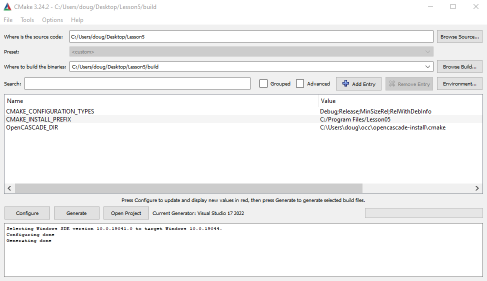
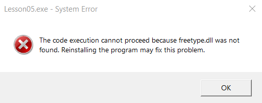
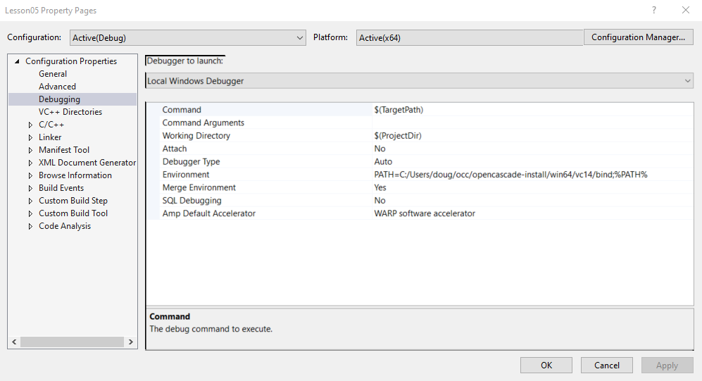

## Lesson 5: Configuring with CMake
* Lesson 5 teaches a new way of configuring the previous project, using a CMakeLists.txt file to accomplish the configuration details previously done in Visual Studio properties window.
* This is very helpful, teaching a configuration approach with several advantages:
    * This makes the project more **portable** by using what look like "CMAKE_ENVIRONMENT_VARIABLES" to configure the locations of directories for includes, libraries, dlls/shared libraries etc.
        * For example, I placed the project folder on the Windows Desktop, rather than in the`C:\Users\doug\source\repos` folder with all the other Visual Studio projects.
    * Replaces the tedious task of having to discover all the needed include files and listing them with using a `foreach` loop to load them all.
    * By weaning away from using the Visual Studio properties window, it opens the door to using other IDE's on other platforms.
* The first step in the new process is to open cmake-gui and configure it like so:



* Click sequentially on **Configure** then **Generate** then **Open Project**
* Then close Visual Studio after each time through this cycle.
* On the "final cycle", right click on the project in Visual Studio and click "Set as Startup Project". Then hit F5 key to run executable. This almost worked, producing the following error.



* I know what to do for this. I stumbled on this earlier in Lesson 4. I have to add the path to `freetype.dll` to the runtime environment. Currently it is not there, as can be seen in this screenshot of the Visual Studio property page.



* I tried adding it in CMakeLists.txt but that resulted in a configuration error. So I went ahead and added it by editing the environment PATH in the property page. This allowed the executable to work.
* Interestingly, when I used CMakeLists.txt to build Lesson_04 on Ubuntu, I didn't face this same problem. I believe the reason is that when I installed OpenCascade in Ubuntu, I installed freetype **prior** to installing OpenCascade, so its shared library is in a standard location, requiring no tinkering with **PATH**.
* Another thing I did on Ubuntu was to set Open_CASCADE_DIR in the CMakeLists.txt file. (In Windows it was done using VisualStudio property pages.)
* Below is `CMakeLists.txt` used on Ubuntu. Using this as a template, perhaps it will now be possible to build any of Quaoar's Workshop OpenCascade Lessons on Ububntu (as long as they don't contain **Windows only** code).

```
cmake_minimum_required (VERSION 3.0.0 FATAL_ERROR)

SET(CMAKE_INSTALL_PREFIX "/home/doug/OCC/opencascade-install")

SET(OpenCASCADE_DIR "/home/doug/OCC/opencascade-install/lib/cmake/opencascade")

project(Lesson_04 CXX)

find_package(OpenCASCADE)

# Configure C++ compiler's includes dir
include_directories(SYSTEM ${OpenCASCADE_INCLUDE_DIR})

add_executable(Lesson_04
  main.cpp
  Viewer.cpp
  ViewerInteractor.cpp
  Viewer.h
  ViewerInteractor.h
)

message(STATUS "OpenCASCADE_LIBRARY_DIR= ${OpenCASCADE_LIBRARY_DIR}")

# Add linker options
foreach(LIB ${OpenCASCADE_LIBRARIES})
  target_link_libraries(Lesson_04 debug ${OpenCASCADE_LIBRARY_DIR}/lib${LIB}.so)
  message(STATUS "LIB=${LIB}")
endforeach()
```


